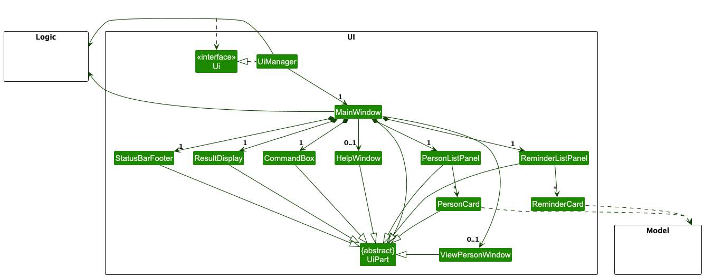
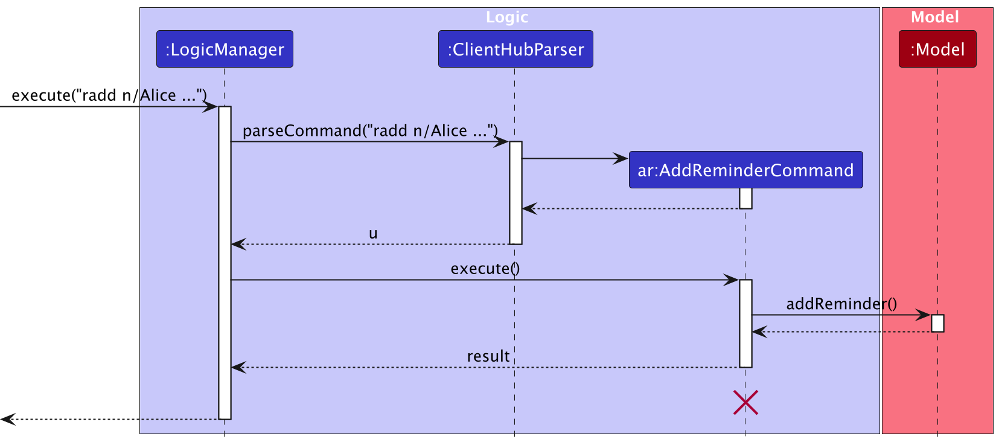
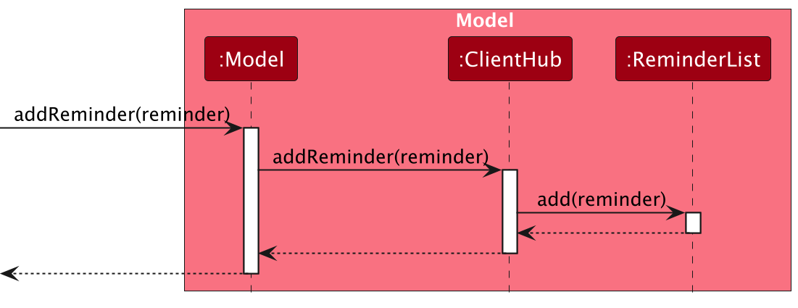
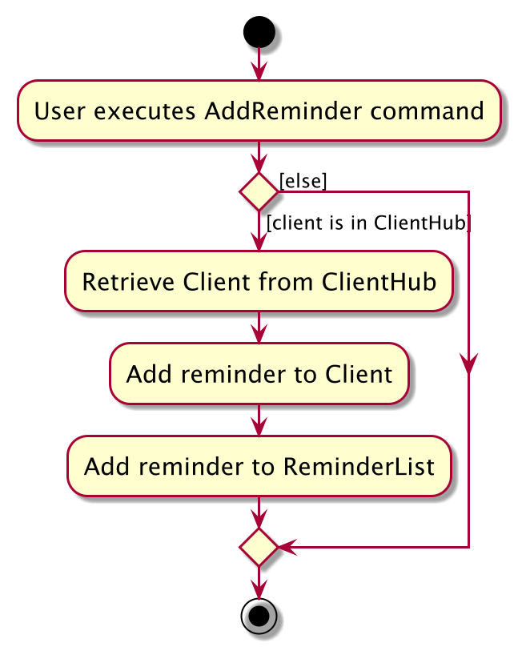

* Table of Contents
{:toc}

--------------------------------------------------------------------------------------------------------------------

## **Acknowledgements**

* {list here sources of all reused/adapted ideas, code, documentation, and third-party libraries -- include links to the original source as well}

--------------------------------------------------------------------------------------------------------------------

## **Setting up, getting started**

Refer to the guide [_Setting up and getting started_](SettingUp.md).

--------------------------------------------------------------------------------------------------------------------

## **Design**

:bulb: **Tip:** The `.puml` files used to create diagrams in this document `docs/diagrams` folder. Refer to the [_PlantUML Tutorial_ at se-edu/guides](https://se-education.org/guides/tutorials/plantUml.html) to learn how to create and edit diagrams.

### Architecture

The ***Architecture Diagram*** given above explains the high-level design of the App.

Given below is a quick overview of main components and how they interact with each other.

**Main components of the architecture**

**`Main`** (consisting of classes [`Main`](https://github.com/se-edu/addressbook-level3/tree/master/src/main/java/seedu/address/Main.java) and [`MainApp`](https://github.com/se-edu/addressbook-level3/tree/master/src/main/java/seedu/address/MainApp.java)) is in charge of the app launch and shut down.
* At app launch, it initializes the other components in the correct sequence, and connects them up with each other.
* At shut down, it shuts down the other components and invokes cleanup methods where necessary.

The bulk of the app's work is done by the following four components:

* [**`UI`**](#ui-component): The UI of the App.
* [**`Logic`**](#logic-component): The command executor.
* [**`Model`**](#model-component): Holds the data of the App in memory.
* [**`Storage`**](#storage-component): Reads data from, and writes data to, the hard disk.

[**`Commons`**](#common-classes) represents a collection of classes used by multiple other components.

**How the architecture components interact with each other**

The *Sequence Diagram* below shows how the components interact with each other for the scenario where the user issues the command `delete Alice`.

Each of the four main components (also shown in the diagram above),

* defines its *API* in an `interface` with the same name as the Component.
* implements its functionality using a concrete `{Component Name}Manager` class (which follows the corresponding API `interface` mentioned in the previous point.

For example, the `Logic` component defines its API in the `Logic.java` interface and implements its functionality using the `LogicManager.java` class which follows the `Logic` interface. Other components interact with a given component through its interface rather than the concrete class (reason: to prevent outside component's being coupled to the implementation of a component), as illustrated in the (partial) class diagram below.

The sections below give more details of each component.

### UI component

The **API** of this component is specified in [`Ui.java`](https://github.com/AY2425S1-CS2103T-F10-1/tp/blob/master/src/main/java/seedu/address/ui/Ui.java)

The UI consists of a `MainWindow` that is made up of parts e.g.`CommandBox`, `ResultDisplay`, `PersonListPanel`, `StatusBarFooter` etc. All these, including the `MainWindow`, inherit from the abstract `UiPart` class which captures the commonalities between classes that represent parts of the visible GUI.

The `UI` component uses the JavaFx UI framework. The layout of these UI parts are defined in matching `.fxml` files that are in the `src/main/resources/view` folder. For example, the layout of the [`MainWindow`](https://github.com/AY2425S1-CS2103T-F10-1/tp/blob/master/src/main/java/seedu/address/ui/MainWindow.java) is specified in [`MainWindow.fxml`](https://github.com/AY2425S1-CS2103T-F10-1/tp/blob/master/src/main/resources/view/MainWindow.fxml)

The `UI` component,

* executes user commands using the `Logic` component.
* listens for changes to `Model` data so that the UI can be updated with the modified data.
* keeps a reference to the `Logic` component, because the `UI` relies on the `Logic` to execute commands.
* depends on some classes in the `Model` component, as it displays `Person` and `Reminder` object residing in the `Model`. (For eg. `PersonListPanel` , `PersonCard`, `ReminderListPanel`, `ReminderCard`)

### Logic component

**API** : [`Logic.java`](https://github.com/AY2425S1-CS2103T-F10-1/tp/blob/master/src/main/java/seedu/address/logic/Logic.java)

Here's a (partial) class diagram of the `Logic` component:

The sequence diagram below illustrates the interactions within the `Logic` component, taking `execute("delete Alice")` API call as an example.

:information_source: **Note:** The lifeline for `DeleteCommandParser` should end at the destroy marker (X) but due to a limitation of PlantUML, the lifeline continues till the end of diagram.

How the `Logic` component works:

1. When `Logic` is called upon to execute a command, it is passed to an `ClientHubParser` object which in turn creates a parser that matches the command (e.g., `DeleteCommandParser`) and uses it to parse the command.
1. This results in a `Command` object (more precisely, an object of one of its subclasses e.g., `DeleteCommand`) which is executed by the `LogicManager`.
1. The command can communicate with the `Model` when it is executed (e.g. to delete a person). 
   Note that although this is shown as a single step in the diagram above (for simplicity), in the code it can take several interactions (between the command object and the `Model`) to achieve.
1. The result of the command execution is encapsulated as a `CommandResult` object which is returned back from `Logic`.

Here are the other classes in `Logic` (omitted from the class diagram above) that are used for parsing a user command:

How the parsing works:
* When called upon to parse a user command, the `ClientHubParser` class creates an `XYZCommandParser` (`XYZ` is a placeholder for the specific command name e.g., `AddCommandParser`) which uses the other classes shown above to parse the user command and create a `XYZCommand` object (e.g., `AddCommand`) which the `AddressBookParser` returns back as a `Command` object.
* All `XYZCommandParser` classes (e.g., `AddCommandParser`, `DeleteCommandParser`, ...) inherit from the `Parser` interface so that they can be treated similarly where possible e.g, during testing.

### Model component
**API** : [`Model.java`](https://github.com/AY2425S1-CS2103T-F10-1/tp/blob/master/src/main/java/seedu/address/model/Model.java)

The `Model` component,

* stores the client hub data i.e., all `Person` objects (which are contained in a `UniquePersonList` object) and all Reminders(which are contained in a ReminderList object).
* stores the currently 'selected' `Person` objects (e.g., results of a search query) as a separate _sorted_ list composed using a _filtered_ list which is exposed to outsiders as an unmodifiable `ObservableList<Person>` that can be 'observed' e.g. the UI can be bound to this list so that the UI automatically updates when the data in the list change.
* 
* stores a `UserPref` object that represents the user’s preferences. This is exposed to the outside as a `ReadOnlyUserPref` objects.
* does not depend on any of the other three components (as the `Model` represents data entities of the domain, they should make sense on their own without depending on other components)

:information_source: **Note:** An alternative (arguably, a more OOP) model is given below. It has a `Client Type` list in the `ClientHub`, which `Person` references. This allows `ClientHub` to only require one `ClientType` object per unique client type, instead of each `Person` needing their own `ClientType` objects. 

### Storage component

**API** : [`Storage.java`](https://github.com/se-edu/addressbook-level3/tree/master/src/main/java/seedu/address/storage/Storage.java)

The `Storage` component,
* can save both ClientHub data and user preference data in JSON format, and read them back into corresponding objects.
* inherits from both `ClientHubStorage` and `UserPrefStorage`, which means it can be treated as either one (if only the functionality of only one is needed).
* depends on some classes in the `Model` component (because the `Storage` component's job is to save/retrieve objects that belong to the `Model`)

### Common classes

Classes used by multiple components are in the `seedu.address.commons` package.

--------------------------------------------------------------------------------------------------------------------

## **Implementation**

This section describes some noteworthy details on how certain features are implemented.

### Add Reminder Feature

#### Implementation
The add reminder mechanism is done by altering the `ReminderList` which is
facilitated by `ClientHub` class. Additionally , `ClientHub` also implements
the following operations:
- `ClientHub#editReminder()` - Edits the reminder in the reminder list.
- `ClientHub#deleteReminder()` - Deletes the reminder from the reminder list.

Given below is an example usage scenario and how the add reminder mechanism behaves at each step.

Step 1. The user launches the application for the first time. The `ClientHub` will be initialized with an empty reminder list and a initial.
Client list.

Step 2. The user finds a client in the client list to add a reminder for for eg. `Alice Pauline`. The
User will then execute `radd n/Alice Pauline dt/2022-10-10 12:00 d/lunch` command to add a reminder for Alice Pauline.
The `radd` command calls `ClientHub#addReminder()`, causing the reminder to be added to the reminder list.

The following sequence diagram shows how an add reminder operation goes through the `Logic` component:

Similarly, how an add reminder operation goes through the `Model` component is shown below:

The following activity diagram summarizes what happens when a user executes a add reminder command:

--------------------------------------------------------------------------------------------------------------------

## **Documentation, logging, testing, configuration, dev-ops**

* [Documentation guide](Documentation.md)
* [Testing guide](Testing.md)
* [Logging guide](Logging.md)
* [Configuration guide](Configuration.md)
* [DevOps guide](DevOps.md)

--------------------------------------------------------------------------------------------------------------------

## **Appendix: Requirements**

### Product scope

**Target user profile**:

* Tech-savvy Independent Financial Advisors who manage more than 50 clients.
* Have a need to efficiently manage a large volume of client details, such as insurance policies and financial plans.
* Prefer desktop apps over other types of interfaces for their daily work.
* Can type quickly and are comfortable using CLI applications, favoring typing over mouse-based interactions for efficiency.
* Require a simple and streamlined tool that makes it easy to access and track client information with minimal clicks.
* Value simplicity and efficiency in their tools to save time and focus on client relationships.
* Need a system that provides quick access to relevant client information, including financial plans, policy expiration dates, and contact details.
* Often handle tasks that involve tracking insurance policies, renewals, and financial documents.

**Value proposition**: Our product provides independent financial advisors with a streamlined tool to manage client details (eg. Track insurance policies) as well as create reminders for meet ups with them. Optimized for simplicity and efficiency, this product makes the lives of financial advisors easier by offering easier access to relevant information of their clients and important dates their clients.

### User stories

Priorities: High (must have) - `* * *`, Medium (nice to have) - `* *`, Low (unlikely to have) - `*`

| Priority | As a …​             | I want to …​                                                                    | So that I can…​                               |
|----------|---------------------|---------------------------------------------------------------------------------|-----------------------------------------------|
| `* * *`  | financial advisor   | add a new client’s contact details                                              | easily manage my client base                  |
| `* * *`  | financial advisor   | view all of a client’s details on one screen                                    | have all necessary information in one place.  |
| `* * *`  | financial advisor   | delete outdated client contact information                                      | keep my database clean and relevant           |
| `* *`    | financial advisor   | search for a client by their personal information, such as name or phone number | ensure that I always have the latest details  |
| `* *`    | financial advisor   | sort all clients in alphabetical order based on their names                     | prioritize my communication with them         |
| `*`      | financial advisor   | update a client’s contact information                                           | ensure that I always have the latest details  |
| `*`      | financial advisor   | tag clients with specific client types (e.g., investor, retiree)                | segment them for different services           |
| `*`      | financial advisor   | add description to a client’s profile                                           | track important interactions or discussions   |
| `*`      | financial advisor   | assign reminders to each client (e.g., "Review investment portfolio")           | stay organized and focused                    |

*{More to be added}*

### Use cases

(For all use cases below, the **System** is the `ClientHub` and the **Actor** is the `user`, unless specified otherwise)

**Use case: Add a new client**

**MSS**
1. User inputs the command to add a client's contact
2. ClientHub adds the contact to the list of contacts
3. ClientHub shows successful output message

    Use case ends.

**Extensions**

* 1a. ClientHub detects invalid input format
  * 1a1. ClientHub shows an error message and shows the correct format for the wrong input
      Step 1 is repeated until user inputs the correct format.

* 1b. ClientHub detects missing fields

  * 1b1. ClientHub shows an error message informing user that required field(s) are missing

    Step 1 is repeated until user inputs all required fields.
 

* 1c. ClientHub detects a duplicate contact

  * 1c1. ClientHub informs user that there is more than one contact with the same name and prompt the user to input a 
    different name.
    
    Step 1 is repeated until user inputs a unique name.
  

**Use case: Delete a client**

**MSS**

1. User keys in the command to delete a client
2. ClientHub deletes the person
3. ClientHub shows successful output message

    Use case ends.

**Extensions**

* 1a. ClientHub detects invalid input format

    * 1a1. ClientHub shows an error message that the input is in the wrong format

      Step 1 is repeated until user inputs the correct format.

* 1b. ClientHub detects that the given name is not in the list
 
    * 1b1. ClientHub shows an error message that the name is not in the list

        Use case ends.

* 1c. ClientHub detects multiple contacts of the same name

    * 1c1. ClientHub informs the user that there are multiple contacts with the same name and requests the user to input the full name of the contact

        Step 1 is repeated until user inputs full name of the contact.

**Use case: List contacts**

**MSS**
1. User requests to list all contacts
2. ClientHub shows the list of all contacts saved

**Extensions**

* 1a. ClientHub detects unknown command
    * 1a1. ClientHub shows an error message that the command is not recognized

        Use case ends.

**Use case: Search for a contact**

**MSS** 
1. User inputs the command to search for a contact
2. ClientHub searches for the contact
3. ClientHub shows the contact details

    Use case ends.

**Extensions**

* 1a. ClientHub detects invalid input format
    * 1a1. ClientHub shows an error message that the input is in the wrong format

        Step 1 is repeated until user inputs the correct format.
* 1b. ClientHub detects that the given name is not in the list
    * 1b1. ClientHub shows an error message that the name is not in the list

        Use case ends.
* 1c. ClientHub detects multiple clients that matches the same name
    * 1c1. ClientHub informs the user that multiple clients matches the same name and requests the user to input the full name of the client

        Step 1 is repeated until user inputs full name of the contact.

**Use case: Edit a client**

**MSS**
1. User inputs the command to edit a client's contact
2. ClientHub edits the contact details
3. ClientHub shows successful output message

    Use case ends.

**Extensions**

* 1a. ClientHub detects invalid input format
    * 1a1. ClientHub shows an error message that the input is in the wrong format

        Step 1 is repeated until user inputs the correct format.
* 1b. ClientHub detects that the given name is not in the list
    * 1b1. ClientHub shows an error message that the name is not in the list

        Use case ends.
* 1c. ClientHub detects multiple contacts of the same name
    * 1c1. ClientHub informs the user that there are multiple contacts with the same name and requests the user to input the full name of the contact

        Step 1 is repeated until user inputs full name of the contact.

**Use case: Sort clients**

**MSS**

1. User inputs the command to sort clients
2. ClientHub sorts the clients in alphabetical order based on their names
3. ClientHub shows the sorted list of clients

    Use case ends.

**Extensions**

* 1a. ClientHub detects unknown command
    * 1a1. ClientHub shows an error message that the command is not recognized

        Use case ends.
* 1b. ClientHub detects invalid input format
    * 1b1. ClientHub shows an error message that the input is in the wrong format

        Step 1 is repeated until user inputs the correct format.

**Use case: Add reminder**

**MSS**

1. User inputs the command to add a reminder
2. ClientHub adds the reminder to the client
3. ClientHub shows successful output message
    Use case ends.

**Extensions**

* 1a. ClientHub detects invalid input format
    * 1a1. ClientHub shows an error message that the input is in the wrong format

        Step 1 is repeated until user inputs the correct format.
* 1b. ClientHub detects that the given name is not in the list
    * 1b1. ClientHub shows an error message that the name is not in the list

        Use case ends.
* 1c. ClientHub detects multiple contacts of the same name
    * 1c1. ClientHub informs the user that there are multiple contacts with the same name and requests the user to input the full name of the contact

        Step 1 is repeated until user inputs full name of the contact.
* 1d. ClientHub detects that the reminder is already added
    * 1d1. ClientHub shows an error message that the reminder is already added

        Use case ends.

**Use case: Delete reminder**

**MSS**

1. User inputs the command to delete a reminder
2. ClientHub deletes the reminder from the client
3. ClientHub shows successful output message
    Use case ends.

**Extensions**

* 1a. ClientHub detects invalid input format
  * 1a1. ClientHub shows an error message that the input is in the wrong format

      Step 1 is repeated until user inputs the correct format.
* 2a. ClientHub detects the given index is out of range
    * 2a1. ClientHub shows an error message that the index is out of range
        
        Step 1 is repeated until user inputs the correct format.

**Use case: Edit reminder**

**MSS**
1. User inputs the command to edit a reminder
2. ClientHub edits the reminder
3. ClientHub shows successful output message
    Use case ends.

**Extensions**

* 1a. ClientHub detects invalid input format
    * 1a1. ClientHub shows an error message that the input is in the wrong format

        Step 1 is repeated until user inputs the correct format.
* 2a. ClientHub detects the given index is out of range
    * 2a1. ClientHub shows an error message that the index is out of range
        
        Step 1 is repeated until user inputs the correct format.

### Non-Functional Requirements

1.  Should work on any _mainstream OS_ as long as it has Java `17` or above installed.
2.  Should be able to hold up to 1000 client's contact without a noticeable sluggishness in performance for typical usage.
3.  Should be able to load client's contact within 2 seconds to provide a smooth user experience.
4.  As the number of clients increases, the app should be able to handle the increased data load without significant degradation in performance.
5.  A financial advisor with above average typing speed for regular English text (i.e. not code, not system admin commands) should be able to accomplish most of the tasks faster using commands than using the mouse.
6.  The application should have an intuitive and easy-to-navigate UI so that financial advisors can quickly find clients and input data without much training.
7.  The system should be designed to easily accommodate new features or updates.

### Glossary

* **Mainstream OS**: Windows, Linux, Unix, MacOS
* **Private Contact Detail**: A contact detail that is not meant to be shared with others
* **Client**: A person or company that is in the contact list
* **Client Type**: A category used to describe the relationship or status of a client, such as VIP and standard.
* **Contact**: A client's information saved in the system, which includes details such as name, phone number, email, address, client type, and optional descriptions.
* **Financial Advisor**: The primary user of ClientHub, responsible for managing a large number of client contacts and using the system to track details, tasks, and interactions with clients.
* **Tag**: Keywords assigned to clients, such as "investor" or "retiree," used to categorize and segment clients for better management and service delivery.

--------------------------------------------------------------------------------------------------------------------

## **Appendix: Instructions for manual testing**

Given below are instructions to test the app manually.

:information_source: **Note:** These instructions only provide a starting point for testers to work on;
testers are expected to do more *exploratory* testing.

### Launch and shutdown

1. Initial launch 

**For Mac**

    1. Download the jar file and copy into an empty folder called `ClientHu`b in `Desktop`. 
    2. Open Terminal 
    3. Inside the terminal enter: `cd/Desktop/ClientHub`
    4. Then run:`java -jar clienthub.jar` Expected: Shows the GUI with a set of sample contacts. The window size may not be optimum.
   

**For Windows**

    1.Download the jar file and copy into an empty folder called `ClientHub` in `Downloads`. 
    2.Open PowerShell
    3.Inside the Command Prompt enter: `cd Downloads\ClientHub`
    4. Then run:`java -jar clienthub.jar` Expected: Shows the GUI with a set of sample contacts. The window size may not be optimum.

2. Saving window preferences
   1. Resize the window to an optimum size. Move the window to a different location. Close the window.
   2. Re-launch the app by double-clicking the jar file. 
       Expected: The most recent window size and location is retained.

### Deleting a contact

1. Deleting a contact while all contacts are being shown

   1. Prerequisites: List all contacts using the `list` command. Multiple contacts in the list.

   1. Test case: `delete Ahmad` 
      Expected: Contact with name "Ahmad" is deleted. Details of the deleted contact shown in the status message. Timestamp in the status bar is updated.

   1. Test case: `delete x` (where x is a number)  
      Expected: No contact is deleted. Error details shown in the status message. Status bar remains the same.

   1. Other incorrect delete commands to try: `delete` `delete [NAME]` (with a contact not in the list)  
      Expected: Similar to previous.

1. Deleting a contact with the same name

    1. Test case: `delete Jeremy` with more than one contact with the name `Jeremy`  
        Expected: User is prompted to be more specific. Details of the required change are shown in the status message. Status bar remains the same.

### Saving data

1. Checking if changes in data are saved
   1. Use any of the data changing commands eg.`add` `delete` `edit`.
   2. Exit ClientHub with `exit` or closing the window.
   3. Re-launch the app by double-clicking the jar file.  
      Expected: Changes made previously are loaded into the displayed data

